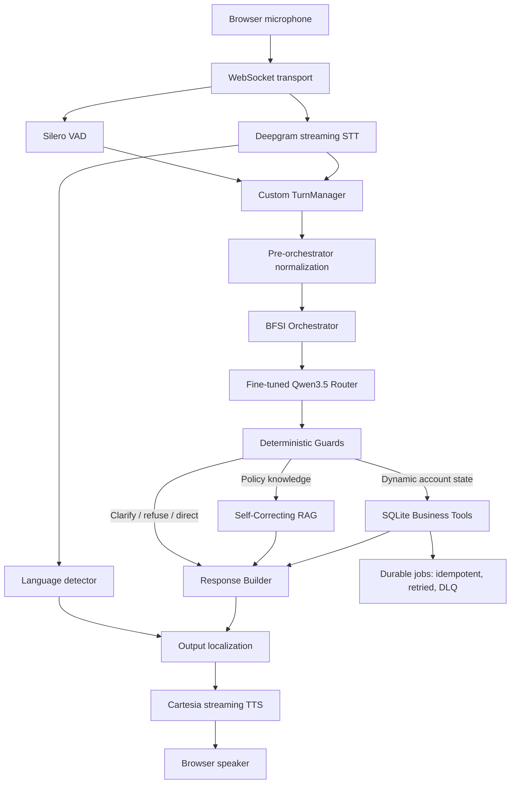
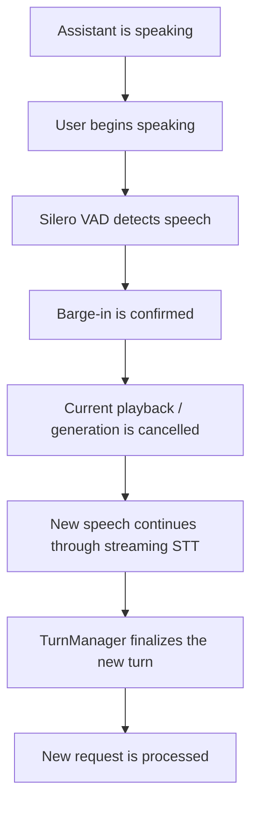

# BFSI Voice Agent

Multilingual **BFSI collections and customer-support voice agent**: realtime browser speech in English, Hindi and Hinglish, a fine-tuned Qwen3.5-4B router served by vLLM, deterministic safety controls, self-correcting RAG over versioned policies, business tools whose side effects go through a guaranteed-delivery job pipeline, and Cartesia streaming TTS with barge-in.

Submitted under the **Open Innovation track (Problem 7)**. The subsystems individually satisfy Problems 1 (self-correcting RAG), 3 (interruption handling), 4 (low-latency multilingual) and 6 (guaranteed delivery); `docs/COVERAGE.md` maps every requirement line to code and to the command that measures it. `docs/PROPOSAL.md` is the filled proposal template.

> Portfolio and research system. The identity-verification mechanism is a local development stand-in and is **not** bank-grade MFA or KYC. Use synthetic customer data only.

## Quick start

```bash
cp .env.example .env            # add DEEPGRAM_API_KEY, CARTESIA_API_KEY, CARTESIA_VOICE_ID
make setup                      # app dependencies
./wsl/install_vllm.sh && ./wsl/start_vllm.sh   # router on :8001 (WSL2/Linux, 8 GB GPU)
make ingest                     # FAISS index for DOMAIN (default bfsi)
make run                        # open http://localhost:8000
```

Or with Docker:

```bash
docker compose up --build                     # GPU host: vLLM + app + worker + jobs API
docker compose --profile hosted up app worker jobs-api   # no GPU: set VLLM_BASE_URL / VLLM_MODEL in .env to any OpenAI-compatible endpoint
```

`make help` lists every command. `make test` (34 tests, no GPU or keys needed), `make chaos` (4 failure tests against real worker processes), `make eval` (language detection, RAG baseline vs self-correcting, 120-case router benchmark), `make bench` (per-stage voice latency and barge-in tables from recorded sessions).

## What it does

The agent accepts live speech from a browser, detects the caller's language per utterance, routes each request through a fine-tuned intent/tool model, enforces deterministic business and privacy rules, retrieves policy evidence when required, executes account tools when permitted (queuing their downstream effects durably), and streams a grounded spoken response in the caller's language.

### Core capabilities

- Realtime browser voice over WebSocket; Deepgram multi-language streaming STT; Silero VAD; custom turn manager
- **Automatic language detection** per utterance (script, Hinglish lexicon, Deepgram word tags); reply follows the caller; Hinglish resolves to Hindi; mid-session switching keeps all state; fixed English/Hindi override available
- Barge-in with **end-to-end stop-latency measurement** (VAD onset to silenced speaker) and false-positive suppression with counted reasons
- Fine-tuned **Qwen3.5-4B** BFSI router (LoRA) served by vLLM, 17 intents, validated JSON decisions, frozen and benchmarked
- Deterministic privacy, verification, date, amount and credential-safety guards outside the model
- Session identity verification with automatic resume of the original request
- Self-correcting RAG: query analysis, retrieval, evidence evaluation, conflict detection across policy versions, rewriting, clarification and abstention, citations; a **baseline RAG** for comparison
- **Domain packs**: `domains/bfsi` and `domains/ecommerce` (the evaluators' orders, policies, returns policy v1/v2, shipping FAQ, catalog, macros and eval questions). `DOMAIN=ecommerce` switches corpus, index and eval defaults
- **Guaranteed-delivery job pipeline** for business writes: idempotency keys, lease-based claims, retries with backoff, DLQ, side-effect ledger, REST API, chaos scripts
- Per-turn stage latency recording and a report that checks P95 against the Problem 4 targets
- English and Hindi output localisation with spoken-number rendering; Cartesia Sonic streaming TTS

## End-to-end architecture



The router performs classification and tool selection. It **does not directly execute business actions**. Sensitive decisions remain in deterministic code.

---

## Router

The routing model is a fine-tuned Qwen3.5-4B adapter designed for multilingual BFSI collections/customer-support requests.

### Supported intents

1. `payment_reminder`
2. `promise_to_pay`
3. `callback_request`
4. `paid_already`
5. `partial_payment`
6. `financial_hardship`
7. `dispute`
8. `wrong_number`
9. `refusal_to_pay`
10. `human_escalation`
11. `policy_question`
12. `account_status`
13. `identity_verification`
14. `ambiguous`
15. `out_of_scope`
16. `privacy_sensitive`
17. `prompt_injection`

### Available business tools

- `get_customer_account`
- `get_outstanding_balance`
- `record_promise_to_pay`
- `schedule_callback`
- `record_payment_reported`
- `open_dispute`
- `record_financial_hardship`
- `request_human_escalation`
- `get_policy`
- `get_call_history`

---

## Safety and business controls

The project intentionally separates probabilistic model behavior from deterministic controls.

### Identity verification

Sensitive account operations are gated by a session-scoped verification registry. An unverified user cannot access protected account information. After successful verification, the original pending request is resumed automatically.

The voice flow also handles naturally spoken digits such as:

```text
zero six four one
0 6 4 1
```

and includes protection against STT smart-format artifacts during verification.

### Privacy

Third-party account requests are blocked even when the caller claims permission.

### Credential safety

The system is designed not to request or expose OTPs, CVVs, PINs, passwords, full card numbers, or another customer's private information.

### Promise-to-pay dates

Explicit dates may be normalized deterministically. Vague expressions such as “next week”, “after payday”, or “month-end” require clarification rather than inventing a calendar date.

### Amount validation

Payment amounts are checked before writes and cannot silently exceed the known outstanding balance.

---

## Self-Correcting RAG

Policy questions are routed to a separate retrieval pipeline rather than answered from model memory.

Features include:

- query analysis and rewriting
- multilingual embeddings
- FAISS retrieval
- evidence sufficiency evaluation
- conflict detection
- policy-version metadata
- active/superseded policy handling
- citations and trace output
- clarification/abstention when evidence is insufficient

The final answer-generation stage prefers the current active policy version for normal present-tense questions while retaining historical versions for explicit historical queries.

---

## Voice runtime

The realtime runtime includes:

- Deepgram persistent streaming STT
- multilingual input recognition
- Silero streaming VAD
- custom endpointing / ASR-settle logic
- verification-specific endpoint timing for slowly spoken digits
- stale-ASR rejection after a turn closes
- barge-in support
- generation cancellation
- automatic output-language detection (English/Hindi override available)
- response localization
- streaming Cartesia TTS
- latency tracing

The normal conversation path remains optimized for responsiveness, while identity-verification turns use a slightly more patient endpoint window so users do not need to rush spoken digits.

---

## Realtime performance and interruption handling

This project is designed as a **realtime conversational system**, not a record-then-process chatbot. Audio, transcription, turn detection, routing and speech synthesis are coordinated as an event-driven pipeline.

### Turn timing configuration

| Setting | Value |
|---|---:|
| Normal endpoint silence | 550 ms |
| Normal ASR settle window | 300 ms |
| Verification endpoint silence | 1600 ms |
| Verification ASR settle window | 900 ms |
| Minimum voiced duration for barge-in | 250 ms |

Identity-verification turns intentionally trade some latency for robustness because users often speak four digits slowly. Measured latency lives in the Evaluation section and in `make bench`.

### Natural interruption / barge-in

The assistant can be interrupted while it is speaking. The runtime does not require the user to wait for TTS playback to finish before starting the next turn.



This matters in customer-support conversations because users frequently interrupt, correct themselves, or respond before a scripted prompt has finished.

### Stale-ASR protection

Streaming ASR providers may emit delayed final transcripts after a conversational turn has already been accepted. The runtime tracks turn state and ignores stale transcripts while the assistant is busy so that a late Deepgram result cannot accidentally become a second user request.

This is particularly important during identity verification, where the same utterance may appear first as spoken digits and later as a differently formatted final transcript.

### Verification-aware speech handling

Normal requests use aggressive endpointing for responsiveness. Verification turns temporarily switch to a longer silence and ASR-settle window so inputs such as:

```text
zero ... six ... four ... one
```

are not prematurely finalized as an incomplete code.

The verification parser also handles common spoken forms (`zero six four one`, `0 6 4 1`, `oh six four one`) and includes a narrow normalization path for Deepgram smart-format artifacts observed during testing.

### Automatic continuation after verification

Account requests are not discarded when verification is required. The system stores the pending request, performs verification, and automatically resumes the original operation after successful verification.

```text
User: What is my outstanding balance?
Agent: Please verify your identity using the requested demo verification step.
User: Zero six four one.
Agent: Identity verified.
       → original balance request resumes automatically
       → protected business tool executes
       → grounded balance response is spoken
```

### Language policy

Speech recognition always runs in multi-language mode. The reply language is resolved per utterance: Devanagari is Hindi, romanised Hindi is detected by a lexicon, and Deepgram's per-word language tags break ties; Hinglish is answered in Hindi. Switching languages mid-session keeps verification, pending requests and idempotency state. The UI can pin English or Hindi for compliance scripts, which is an override, not the default.

---

## Evaluation

Every number comes from a listed command. Which numbers are blind and which are development numbers is stated in `docs/EVALUATION.md`; the short version: the 120-case router benchmark was locked before the final fine-tune stage, the BFSI RAG holdout was inspected during tuning so its 94% is a validation figure, and the 40-case e-commerce RAG eval and the language-detection eval are the ones to run once and quote.

### Router (locked 120-case benchmark, `make router-bench`)

| Metric | Result |
|---|---:|
| JSON valid / schema valid | 100% / 100% |
| Intent accuracy | 98.33% |
| Tool accuracy | 98.33% |
| Argument accuracy | 98.33% |
| RAG routing / clarification accuracy | 100% / 100% |

The two remaining misses are own-account identity-verification phrasings, handled by a deterministic normalisation guard rather than by changing the frozen model. The adapter's own `final_evaluation.json` records 97.5% at freeze time; the production path with guards measures 98.33%.

### RAG (`make eval-rag`, baseline vs self-correcting side by side)

Development set (110 cases, tuned on): self-correcting 96.4% behaviour accuracy, 0% rule-judged hallucination, 100% conflict detection. Holdout (100 cases, inspected during tuning): 94.0%, 80% conflict detection and resolution. Paste the e-commerce blind run here after `DOMAIN=ecommerce make ingest eval-rag`.

### Language detection (`make eval-lid`)

54 utterances (21 English, 10 Devanagari Hindi, 23 Hinglish, including the four evaluator utterances): **100% response-language correctness**, 4 µs mean detection time.

### Guaranteed delivery (`make test`, `make chaos`)

All four failure scenarios pass against real worker processes: duplicate submission (3 submits, 1 job, 1 side effect), SIGKILL mid-job (reclaimed by a second worker, completed once), store restart with 4 queued and 1 in flight (all complete once), permanent failure (3 attempts, 2 backoff retries, DLQ with error). Single-worker throughput with trivial handlers: about 250k jobs/min.

### Voice latency (`make bench`, report after a recorded session)

Observed development snapshot before the final instrumentation, RTX 4060 Laptop, WSL2 vLLM, normal turns:

| Stage | Observed |
|---|---:|
| Router P50 / P95 | 1.85 s / 2.39 s |
| Cartesia TTS first byte | 300 to 400 ms |
| Policy turn, speech end to first audio | about 3.45 s |

Verification turns deliberately use a longer endpoint window (1600 ms silence) so slowly spoken digits are not cut. `make bench` now prints the full per-stage P50/P95 table against the Problem 4 targets once sessions have been recorded.

## Project structure

```text
app/            FastAPI app, WebSocket endpoint, session wiring
voice/          runtime, turn manager, VAD, language detection, barge-in and turn metrics, localisation, STT/TTS clients
integration/    vLLM router client, orchestrator, guards, latency tracker
business/       SQLite repository, tool executor, verification registry, durable write decorator
rag/            baseline and self-correcting RAG, ingestion, retrieval, evidence, conflicts
jobs/           guaranteed-delivery store, worker, handlers, REST API
domains/        bfsi and ecommerce packs: knowledge_base, eval, data
eval/           RAG evaluation harness, language-detection eval, blind-set generator
bench/          latency report
scripts/        router benchmarks and regression scripts
tests/          unit and integration tests; tests/chaos/ failure scripts
docs/           PROPOSAL, PRD, ARCHITECTURE, COVERAGE, EVALUATION, SECURITY, SOLUTION_OVERVIEW
demo/           demo script and scripted turns
wsl/            vLLM install and start scripts
```

## Setup in detail

1. Python 3.10+ (3.12 recommended). `make setup` installs the app requirements with pinned ranges; CPU torch is enough for the app since the LLM runs in vLLM.
2. vLLM runs in its own environment: `./wsl/install_vllm.sh` creates `~/bfsi-vllm/.venv`; `./wsl/start_vllm.sh` serves `unsloth/Qwen3.5-4B` with the LoRA adapter as `bfsi-router` on :8001. The adapter weights (`adapter_model.safetensors`) are not in the repository; set `LORA_PATH` to a complete adapter directory.
3. `.env`: Deepgram and Cartesia keys, `VLLM_BASE_URL`, `DOMAIN`, endpointing and barge-in tuning, jobs settings. See `.env.example`.
4. `make ingest` builds `results/faiss_index/<domain>/`.
5. `make run` starts the app on :8000; `make worker` starts a job worker; `make jobs-api` exposes the jobs REST API on :8010.

Without a GPU: point `VLLM_BASE_URL` and `VLLM_MODEL` at any OpenAI-compatible endpoint serving a chat model and use `docker compose --profile hosted`. Routing accuracy will then reflect that model, not the fine-tuned adapter.

## Design decisions and tradeoffs

| Decision | Why | Cost |
|---|---|---|
| Model interprets, code enforces | Verification, privacy and credential rules cannot depend on a prompt | Guards need regression tests and occasionally cover router misses |
| Router is frozen; fixes go into guards | Keeps the benchmark meaningful | Two known misses live in a normaliser instead of the model |
| Deterministic language detector instead of a model | Under 10 µs, testable, no download; Devanagari is decisive and Hinglish has strong lexical markers | Rare romanised Hindi sentences with no function words fall back to English; the fixed override exists for that |
| Rule-based hallucination judge | Reproducible, does not drift with a judge model | Conservative; misses subtle paraphrase errors |
| SQLite WAL as the job queue | One durable store, no broker to drift from, fits a single-host deployment, every operation is one transaction | Single host; swap the connection for Postgres to scale out |
| Confirm at QUEUED, not COMPLETED | Voice latency is unaffected by downstream delivery | Caller is told the action is recorded before downstream systems see it; the job id is in the trace |
| vLLM with bitsandbytes 4-bit LoRA | Fits an 8 GB laptop GPU, prefix caching, request cancellation | Merging and AWQ would be faster still; not done to keep the frozen adapter byte-identical |
| Browser WebSocket transport | Fastest path to a working demo | No telephony; the runtime is transport-agnostic |

## Known limitations

- Identity verification is demo-grade. Production needs approved authentication, KYC, consent, encryption, audit and regulatory review (`docs/SECURITY.md`).
- The fine-tuned router and business tools are BFSI. The e-commerce domain pack covers RAG, language and evaluation on the evaluators' data; routing e-commerce intents would need retraining.
- Voice latency tables require a recorded session on the submitter's hardware; they are not reproducible in CI.
- The job pipeline is single-host by design. Multi-host needs Postgres (connection swap) and nothing else changes.
- Hindi TTS quality is the provider's; no model was trained.
- Problems 2 and 5 are not attempted (see `docs/PROPOSAL.md`).

## AI tools used

ChatGPT and Claude were used for design discussion, code generation and documentation drafting throughout. All generated code was run, tested and revised by the author; evaluation numbers were produced by the commands in this repository, not by an assistant.

## Documentation

- `docs/PROPOSAL.md`: Open Innovation proposal (Problem 7 template)
- `docs/PRD.md`: requirements, assumptions, failure modes
- `docs/SOLUTION_OVERVIEW.md`: one-page summary
- `docs/ARCHITECTURE.md`: components, request flow, interruption state machine, job lifecycle
- `docs/COVERAGE.md`: requirement-by-requirement map to code and commands
- `docs/EVALUATION.md`: what is measured, how, and which numbers are blind
- `docs/SECURITY.md`: security model and deployment limitations
- `demo/SCRIPT.md`: demo plan

## License

No license has been selected yet. Until a license is added, normal copyright restrictions apply.
