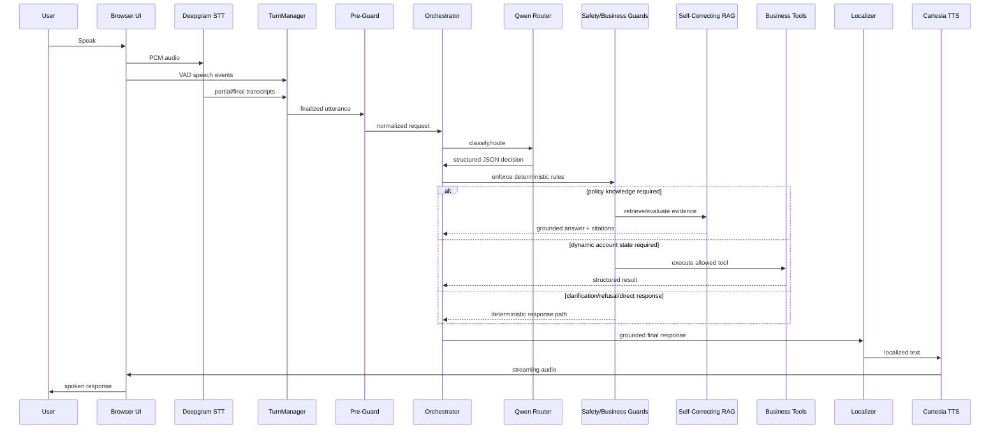
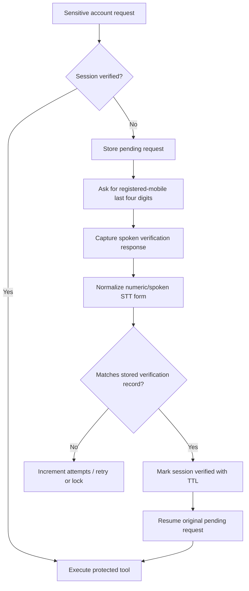
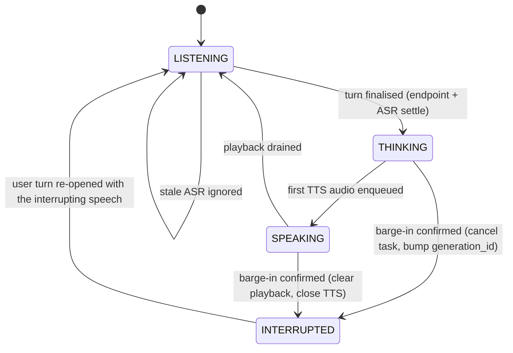
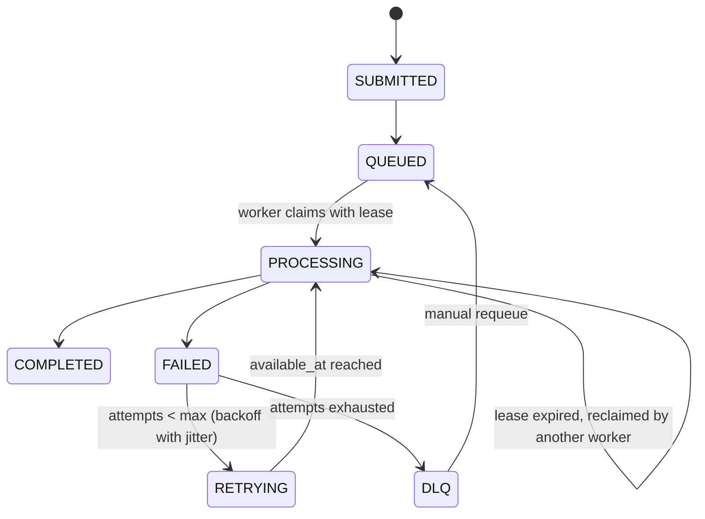

# Architecture

## Goal

This project implements a realtime multilingual BFSI voice agent while keeping model inference, deterministic business rules, retrieval, and tool execution clearly separated.

## Request flow

## Responsibility boundaries

### Fine-tuned Qwen router

Responsible for:

- intent classification
- confidence
- deciding whether RAG is required
- deciding whether a business tool is required
- tool selection
- structured arguments
- clarification signal
- response style/hinting

Not responsible for:

- executing tools
- bypassing verification
- deciding whether sensitive account data can be exposed
- fabricating balances, policy text, dates, or account state

### Deterministic guard layer

Responsible for:

- own-account verification enforcement
- third-party privacy blocking
- restricted-credential safety
- amount validation
- date validation
- unsupported tool-call blocking
- residual normalization for known router edge cases

### Self-Correcting RAG

Responsible for policy knowledge only.

It performs:

- query analysis
- retrieval
- evidence evaluation
- conflict detection
- policy-version handling
- correction/rewrite when needed
- answer generation with citations
- abstention/clarification when evidence is insufficient

### Business tools

Responsible for dynamic customer/account state and writes.

Examples:

- outstanding balance lookup
- customer account lookup
- payment-report recording
- promise-to-pay recording
- callback scheduling
- dispute creation
- hardship recording
- call-history lookup

### Voice runtime

Responsible for realtime interaction:

- microphone audio ingestion
- streaming STT
- VAD
- endpointing
- stale-ASR isolation
- barge-in
- response cancellation
- identity-verification turn timing
- localization
- streaming TTS
- latency metrics

## Identity verification flow

Verification is session-scoped and resets when a new voice session is created.

## Interruption state machine

Barge-in candidates are VAD speech onsets while the assistant is busy. A candidate becomes a confirmed barge-in only if all of these hold:

1. voiced duration is at least `BARGE_MIN_SPEECH_MS` (250 ms default), which rejects coughs, clicks and TTS bleed-through;
2. ASR returns a transcript of at least two characters after `BARGE_CONFIRM_MS`, or a final transcript, within a 2 s window;
3. browser echo cancellation is on, so the agent's own voice rarely reaches the VAD at all.

Rejected candidates are counted with a reason so the false-positive rate can be reported. Confirmed barge-ins increment `generation_id`; every stage after the router checks it and drops stale output, which is why a late TTS chunk from the cancelled turn never reaches the speaker.

Stop latency is measured from VAD onset to the browser having silenced playback: server onset-to-cancel time, plus half the ack round trip, plus the browser's own `clearAudio` time, reported by the client in `barge_ack`.

Context preservation: the interrupting speech re-opens the user turn through the same turn manager, pending identity-verification requests survive, and the write-idempotency guard is keyed by normalised text so a repeated instruction after an interruption is not recorded twice.

## Guaranteed-delivery writes

Write tools (promise to pay, callback, payment claim, dispute, hardship, escalation) record locally and synchronously, then enqueue a `business_write` job keyed by `hash(instance, customer_id, tool, canonical arguments)`. The caller hears the confirmation once the job is durably QUEUED. Workers claim jobs with a lease; a crashed worker's job is reclaimed when the lease expires. Handlers call `ledger.once(key)` before any external action, so a retry after a partial failure never repeats the side effect.

The queue is the SQLite WAL database itself rather than a separate broker. Reasons: one durable store means the job row and the queue position cannot disagree; it runs inside the single-laptop deployment this project targets; and it is swapped for Postgres by changing the connection in `jobs/store.py`, since every operation is a single transaction. The cost is single-host scope, which is stated in the README.

## Turn management

Normal voice turns use fast endpointing for responsiveness. Verification turns use a longer endpoint/ASR-settle window because users often pause between digits.

This solves a common streaming-ASR failure mode where a turn could otherwise finalize after a partial transcript such as `Zero six`, while the final `Zero six four one` arrives slightly later and is correctly rejected as stale.

## RAG policy-version handling

The retrieval layer may intentionally see both active and superseded versions so conflict detection remains possible. For normal current-policy questions, final answer generation prefers active/current policy evidence. Historical queries preserve older versions.

## Observability

The runtime records timing for:

- inference-lock wait
- orchestrator execution
- localization
- TTS time-to-first-byte/audio
- speech-end to first audio

Tool traces also record routing decisions, RAG usage, citations, tool execution status, and guard actions.
