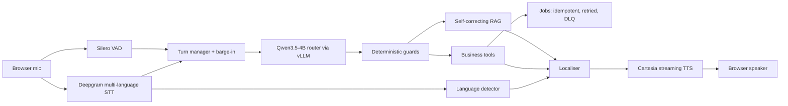

# Open Innovation Track Proposal

**Track:** Problem 7, Open Innovation
**Title:** Multilingual BFSI collections voice agent with self-correcting RAG, interruption handling and guaranteed-delivery writes

## Domain

Banking, financial services and insurance (BFSI): loan collections and customer support over voice, in English, Hindi and Hinglish.

## Problem

Collections calls in India are high volume, multilingual and adversarial. A caller may switch between Hindi and English mid-sentence, interrupt the agent, claim a payment that has not arrived, ask a policy question whose answer changed last quarter, or try to extract another customer's details. A voice agent for this setting has to get four things right at once: understand code-mixed speech fast enough to hold a conversation, answer policy questions only from approved documents, never act on account data without verification, and record every commitment (promise to pay, callback, dispute) exactly once even when infrastructure fails.

No single problem statement in the evaluation repository covers that combination. This proposal is a superset: one system whose subsystems satisfy the metrics of Problems 1, 3, 4 and 6 individually, and which is only useful because they are integrated.

## Target user

1. The borrower on the phone, who needs to be understood in their language and given correct information.
2. The collections operations team, who need every promise and dispute captured reliably and auditable.
3. The compliance officer, who needs proof that account data is verification-gated and that policy answers are grounded.

## Solution

A browser-to-backend realtime pipeline: Silero VAD and Deepgram streaming STT feed a custom turn manager; a fine-tuned Qwen3.5-4B router (LoRA, served by vLLM) classifies intent and selects tools but never executes them; deterministic guards enforce verification, privacy and credential rules; policy questions go to a self-correcting RAG with policy-version conflict handling; account actions go through business tools whose side effects are queued in a guaranteed-delivery job pipeline; the reply is localised to the caller's language and streamed through Cartesia TTS with barge-in support.

## Success metrics

| Metric | Target | Covers |
|---|---|---|
| Router intent accuracy on locked 120-case benchmark | >= 95% | Fine-tuned LLM |
| Router accuracy, base Qwen3.5-4B vs fine-tuned | reported | Fine-tuned LLM |
| RAG hallucination rate, baseline vs self-correcting | self-correcting strictly lower, method documented | PS1 |
| RAG behaviour accuracy (answer / abstain / clarify) | >= 90% on blind set | PS1 |
| Conflict detection on versioned policies | >= 80% | PS1 |
| Barge-in stop latency | P95 < 500 ms | PS3 |
| False barge-in rate with playback into open mic | reported, with suppression counts | PS3 |
| Response-language correctness under auto detection | >= 95% on 54 utterances including mixed | PS4 |
| Mid-session language switch without state reset | demonstrated | PS4 |
| Speech end to first audio | P50 < 2.5 s, P95 < 4 s | PS4 |
| Router (LLM) latency | P95 < 2 s | PS4 |
| TTS first audio | P95 < 1 s | PS4 |
| Exactly-once side effects under crash, duplicate and restart | 4 chaos tests pass | PS6 |
| Job throughput, single worker | reported | PS6 |

## Architecture

See `docs/ARCHITECTURE.md` for the component diagram, the per-turn sequence, the interruption state machine and the job lifecycle.

## Complexity justification

- Realtime constraints: every turn crosses VAD, streaming STT, an LLM, retrieval or a database, translation and streaming TTS, under a 4 second budget, with cancellation at every stage.
- Three failure domains interact: probabilistic routing, retrieval correctness and distributed side effects. The design keeps them separate so each can be tested and regressed on its own.
- Multilingual handling is not a translation layer bolted on at the end: input recognition, output language policy, number verbalisation and TTS voice selection all depend on it.
- Safety is enforced in code, not in prompts, and is covered by regression tests.

## Out of scope

- Problem 2 (document extraction at scale) and the CSM-1B Hindi TTS fine-tune. Neither fits a voice collections agent and each would cost more than the rest of the system combined.
- Problem 5 (multi-tenant gateway). A thin gateway with provider failover is a natural extension and is listed in `docs/COVERAGE.md` as future work.
- Telephony ingress (SIP, PSTN). The transport is a browser WebSocket; the runtime is transport-agnostic.
- Retraining the router on e-commerce intents. The e-commerce domain pack exercises RAG, language and evaluation on the evaluators' data; routing and business tools remain BFSI.
- Production authentication, KYC and encryption. See `docs/SECURITY.md`.

## Timeline (as executed)

| Days | Work |
|---|---|
| 1 to 2 | Router fine-tune (Qwen3.5-4B LoRA), 120-case benchmark, freeze |
| 2 to 3 | Self-correcting RAG: schemas, retrieval, evidence evaluation, conflict detection, rewriting, evaluation harness with baseline |
| 3 to 4 | Voice runtime: VAD, STT, turn manager, barge-in, TTS, localisation |
| 4 to 5 | vLLM serving, latency instrumentation, identity verification state machine |
| 5 to 6 | Auto language detection, barge-in metrics, domain packs, guaranteed-delivery jobs, chaos tests |
| 6 to 7 | Docker, documentation, demo |
